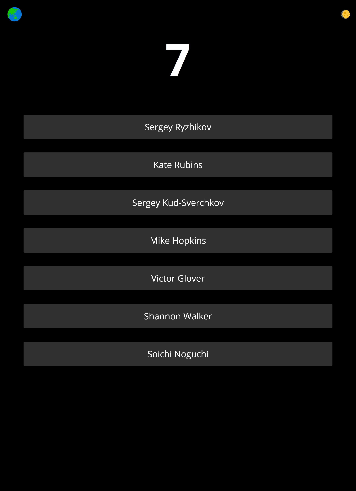

# **Human on ISS**

 

## **Demo**

Visit [humans-on-iss.herokuapp.com](https://humans-on-iss.herokuapp.com/)

 

## **Description**

 

This web application is for getting the number of astronauts on the International Space Station. It is built using the *Django* framework. Used [Open Notify](http://open-notify.org/) api for fetching the data.

 

## **API Used**

`http://api.open-notify.org/astros.json`

 

## **Usage**

 

1. Download the repo. 
2. Create a vitrual environment. (Recommended)
3. Pip Install the *requirements.txt*
4. Start the server.
5. For deployment, change *production.py* file in **main/settings** folder and don't forget to add file path of *local.py* to *.gitignore* file.